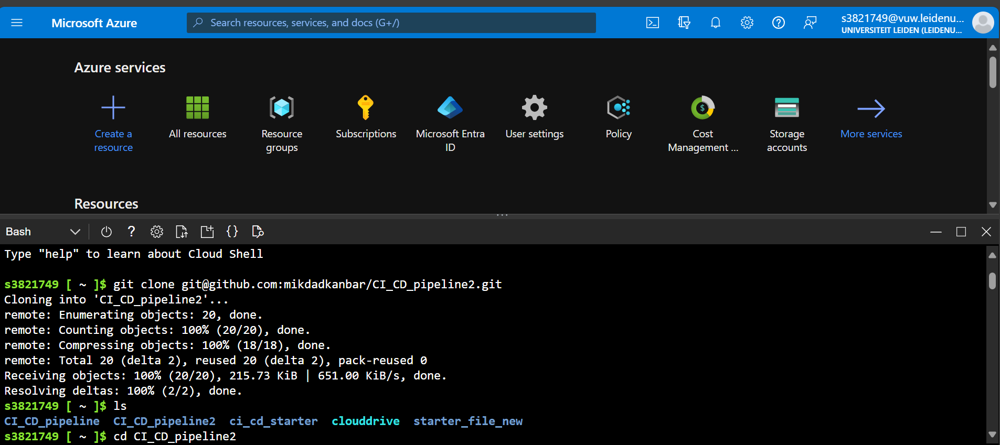
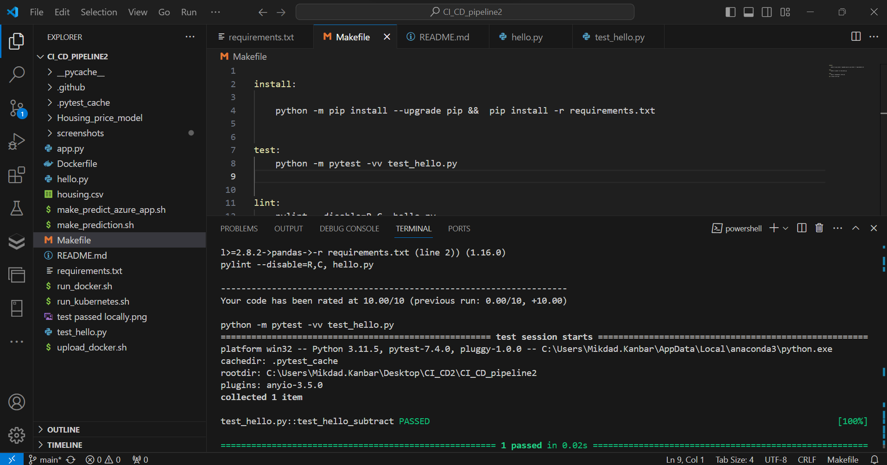
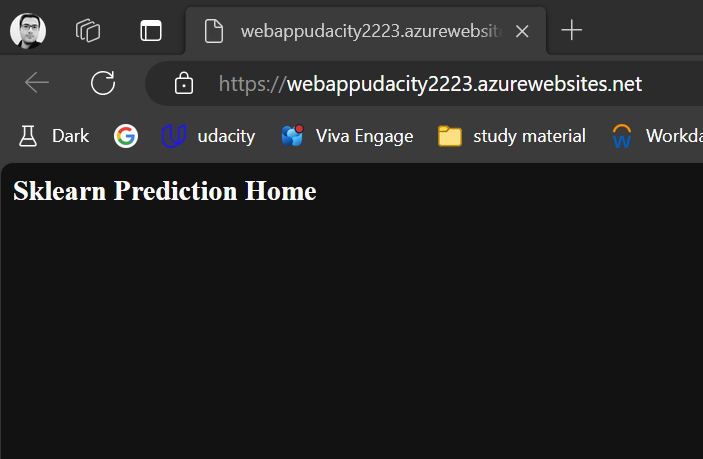
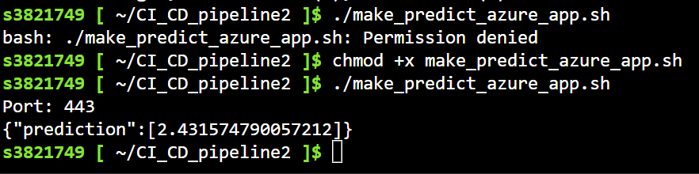
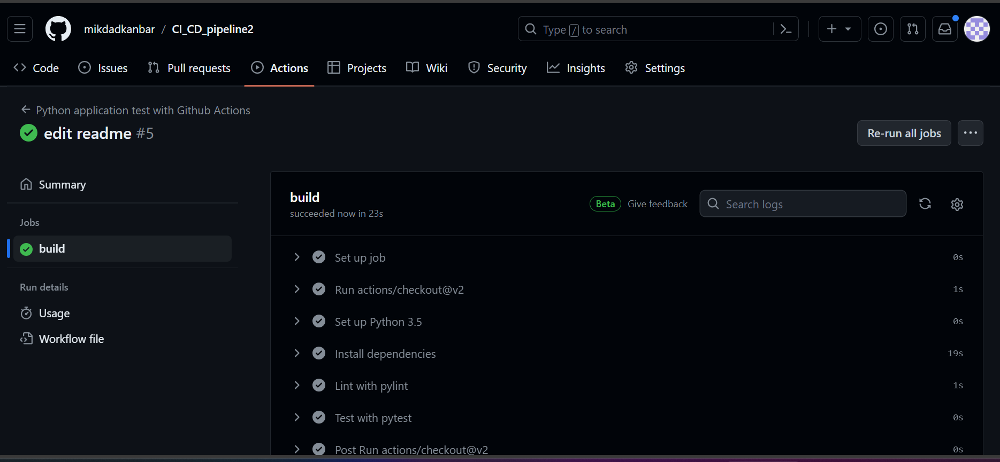
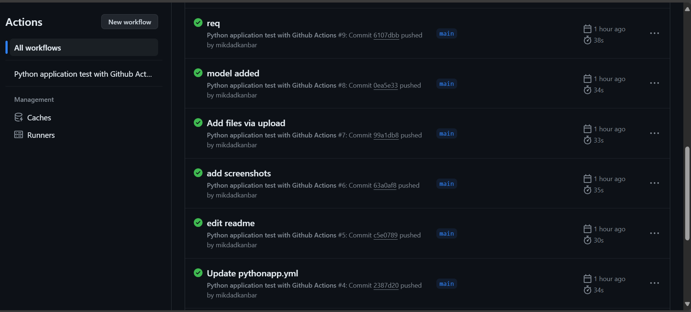
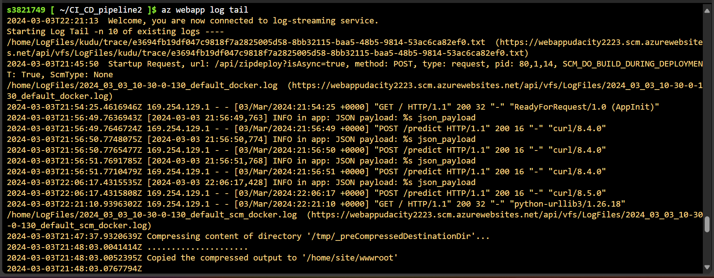
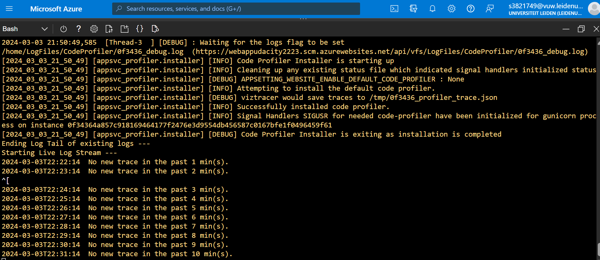
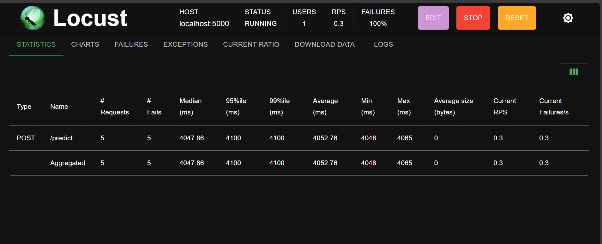

# Overview

 
In this project we will create a  CI/CD pipeline. We will first clone our repo to Azure and then deploy our model by creating a webapp. We will use github actions for continous integration and azure pipelines for continous delivery.
## Project Plan
<TODO: Project Plan > 

Here is the link to Trello

* A link to a Trello board for the project : 
https://trello.com/invite/b/gYtOiBdD/ATTI7d427fe1aec2fa07fe21176aafd9e765B6F86F51/cicd

* A spreadsheet that includes the original and final project plan could be found in the repo

## Instructions

 

 
> First step is to generate ssh key in azure cloud shell using the following command : 
 
ssh-keygen -t rsa

we can view the generated ssh key with the command 'cat' 

- Next step is to clone the github repo command:

"git clone git@github.com:mikdadkanbar/CI_CD_pipeline2.git]"

 

- After successful cloning, we can enter the folder using the 'cd' command:  

cd CI_CD_pipeline2
 
- run make all command: 

make all

- To make sure everything is running smoothly, the code should pass the test after running make all : 

 

- run the python app using this command: 
python app.py
 
- create a webapp using the command: 
az webapp up --name webappudacity2223 --resource-group rgudacity2 --sku F1 --runtime "python|3.9"

Now we should see this : 
 

#test the prediction using the webapp command: 
The key step here is to get access to the file make_predict_azure_app.sh as following : 

     chmod +x make_predict_azure_app.sh
./make_predict_azure_app.sh

We should get the follwing prediction 
 

Now we integrate github actions sothat each time we push, we do continous integration. The following screenshots is from successful run on github actions 

 

 Notice how at each push we trigger the action : 

 

Here is a status badge :

> Now we should create a vm to use it as a self host agent in order to run the pipelines : 
 

#After creating a vm (  for the self hosted agen ), we can connect to it command: 

ssh devopsagent@172.211.88.89

> After we connect to the vm : run all commands in the commands.sh  file , start from here :  

 sudo snap install docker
sudo groupadd docker
sudo usermod -aG docker $USER
exit

  
 

* Output of streamed log files from deployed application
 
  

  

# Load test using Locust :
First we install locust using the command:
pip install locust

Then after starting locust, we go to this link http://localhost:8089 
here you can see the load test :
 

## Demo 

You can see the demo on youtube here : https://youtu.be/OzaoHXqpiLc

