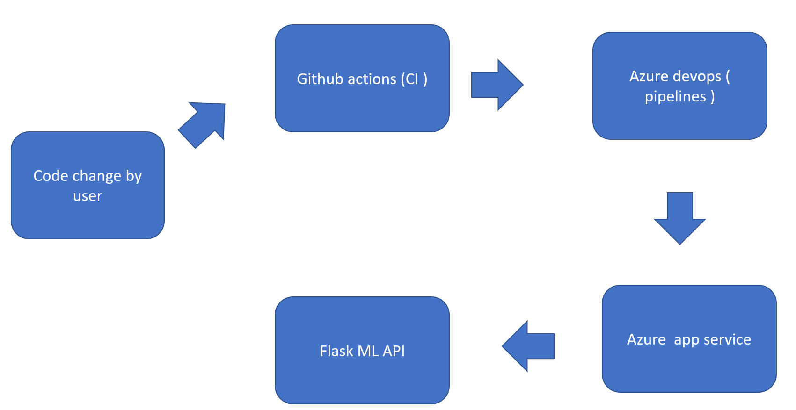
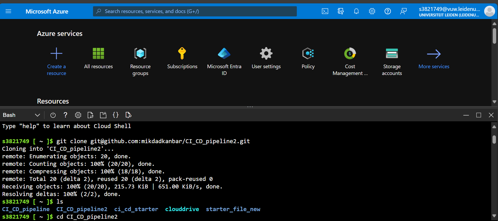
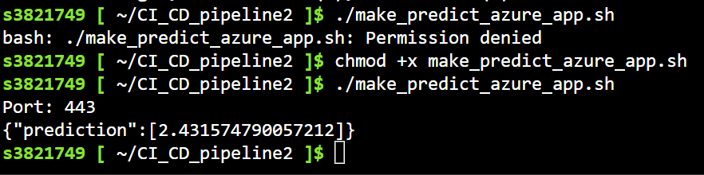
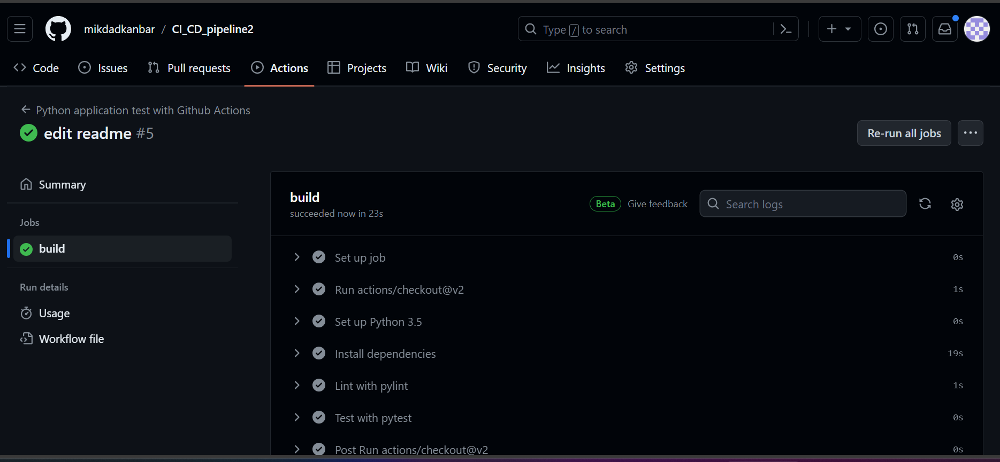
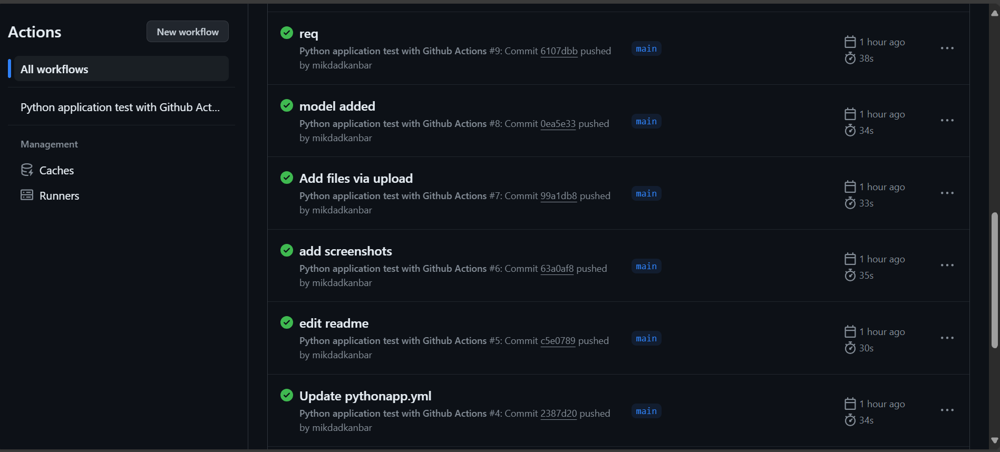
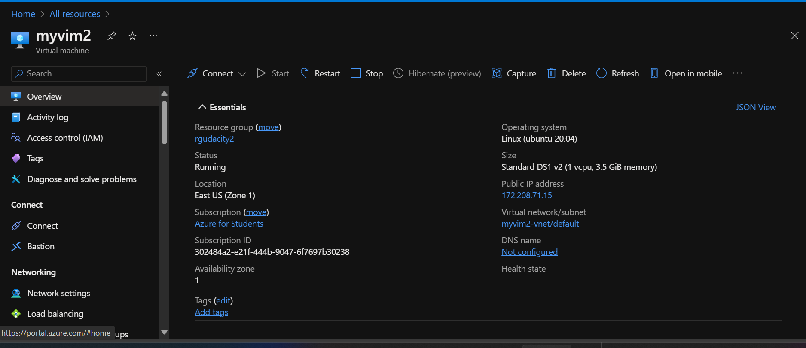

# Overview

 
In this project we will create a  CI/CD pipeline. We will first clone our repo to Azure and then deploy our model by creating a webapp. We will use github actions for continous integration and azure pipelines for continous delivery.
## Project Plan
<TODO: Project Plan > 

* A link to a Trello board for the project
* A link to a spreadsheet that includes the original and final project plan>

## Instructions

 

 
> First step is to generate ssh key in azure cloud shell using the following command : 
 
ssh-keygen -t rsa

we can view the generated ssh key with the command 'cat' 

- Next step is to clone the github repo :

"git clone git@github.com:mikdadkanbar/CI_CD_pipeline2.git]"

 

After successful cloning, we can enter the folder using the 'cd' command:  

cd CI_CD_pipeline2
 
- run make all command: 

make all

- run the python app using this command: 
python app.py
 
- create a webapp using the command: 
az webapp up --name webappudacity2223 --resource-group rgudacity2 --sku F1 --runtime "python|3.9"

#test the prediction using the webapp command: 
The key step here is to get access to the file make_predict_azure_app.sh as following : 

     chmod +x make_predict_azure_app.sh
./make_predict_azure_app.sh

We should get the follwing prediction 
 

Now we integrate github actions sothat each time we push, we do continous integration. The following screenshots is from successful run on github actions 

 

 Notice how at each push we trigger the action : 

 


> Now we should create a vm to use it as a self host agent in order to run the pipelines : 
 

#After creating a vm (  for the self hosted agen ), we can connect to it : 

ssh devopsagent@172.211.88.89

> After we connect to the vm : run all commands in the commands.sh  file , start from here :  

 sudo snap install docker
sudo groupadd docker
sudo usermod -aG docker $USER
exit


 

* Project running on Azure App Service

* Project cloned into Azure Cloud Shell

* Passing tests that are displayed after running the `make all` command from the `Makefile`

* Output of a test run

* Successful deploy of the project in Azure Pipelines.  [Note the official documentation should be referred to and double checked as you setup CI/CD](https://docs.microsoft.com/en-us/azure/devops/pipelines/ecosystems/python-webapp?view=azure-devops).

* Running Azure App Service from Azure Pipelines automatic deployment

* Successful prediction from deployed flask app in Azure Cloud Shell.  [Use this file as a template for the deployed prediction](https://github.com/udacity/nd082-Azure-Cloud-DevOps-Starter-Code/blob/master/C2-AgileDevelopmentwithAzure/project/starter_files/flask-sklearn/make_predict_azure_app.sh).
The output should look similar to this:

```bash
udacity@Azure:~$ ./make_predict_azure_app.sh
Port: 443
{"prediction":[20.35373177134412]}
```

* Output of streamed log files from deployed application

> 

## Enhancements

<TODO: A short description of how to improve the project in the future>

## Demo 

<TODO: Add link Screencast on YouTube>


